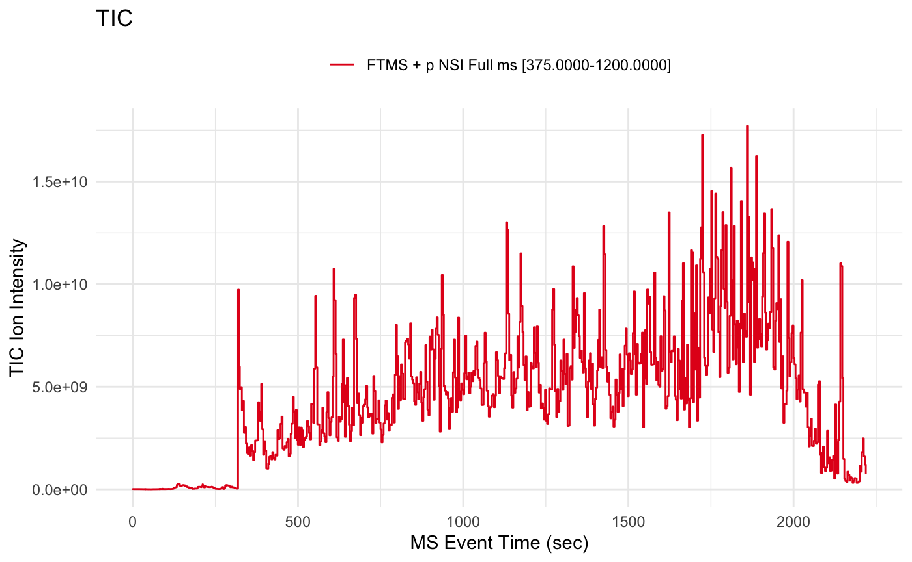
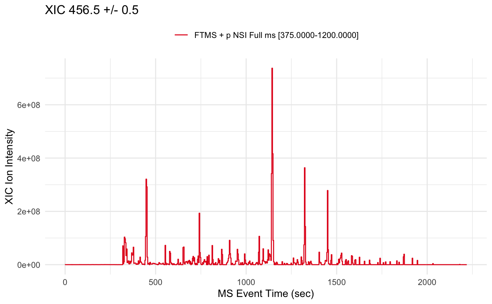
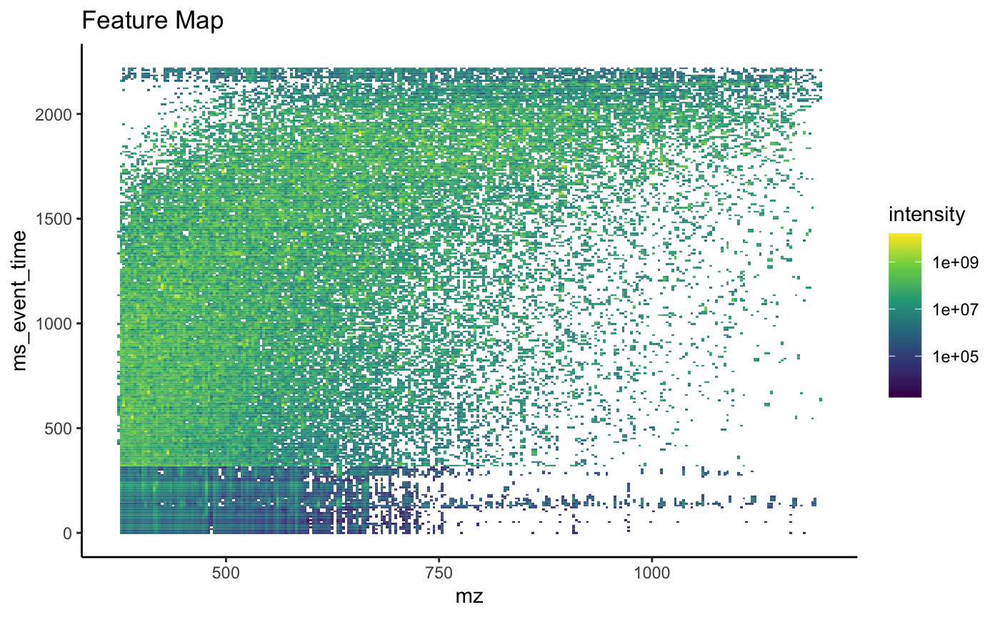

# msreadr 

A simplified mass-spec data reader that creates a standardized data
object for use among the tidyproteomics packages.

## Installation

To install, open R and type:

``` r
install.packages("devtools")
devtools::install_github("jeffsocal/msreadr")
```

… also install other GitHub dependencies

``` r
devtools::install_github("jeffsocal/mspredictr")
```

… also install other Bioconductor dependencies

``` r
install.packages("BiocManager")
BiocManager::install("mzR")
```

## Get Started

Its simple to get started, just point the `read_spectra()` function at a
downloaded MGF or mzML file and save as an object.

``` r
library(msreadr)
mzml <- path_to_example() |> read_spectra()
```

Examine the contents

``` r
mzml
```

    ## 

    ## ── MS SPECTRA data object ──

    ## 

    ## Memory               87.99 MB 
    ## MS1 Scans            900 
    ##   LC time            0.12 - 2218.76 (sec) 
    ##   ~ FTMS + p NSI Full ms [375.0000-1200.0000]  
    ## MS2 Scans            15024 
    ##   LC time            0.65 - 2220.23 (sec) 
    ##   precursors         374.67 - 1196.97 (mz) 
    ## 

Plot a TIC

``` r
mzml |> plot()
```



Plot an XIC

``` r
mzml |> plot(mz = 456.5, mz_tolerance = .5)
```



Plot an MS1 heatmap

``` r
mzml |> plot(type = '3D', bins = 256)
```



## Extending msreader

Check out the related packages
[mspredictr](https://github.com/jeffsocal/mspredictr)
